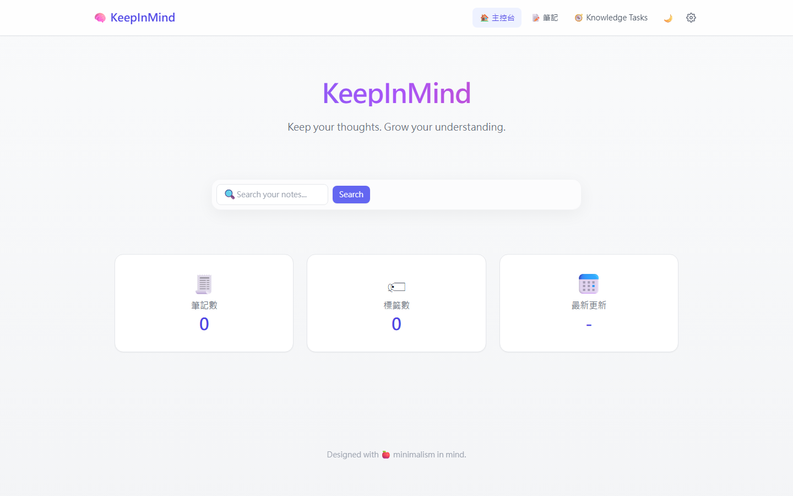
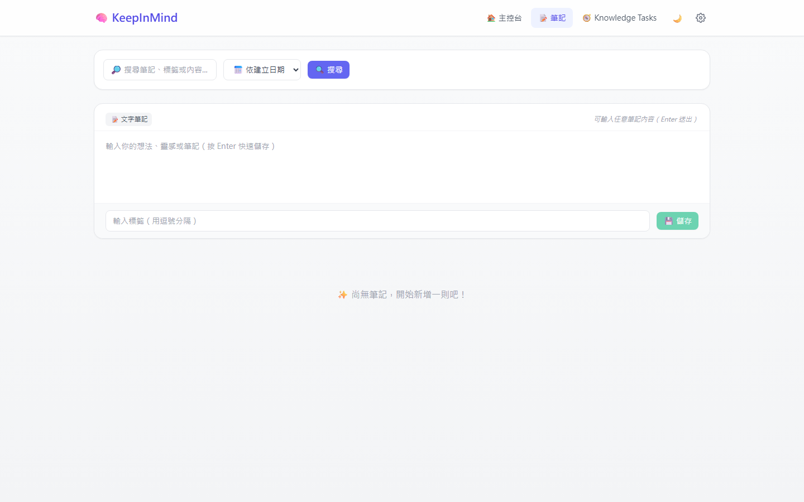
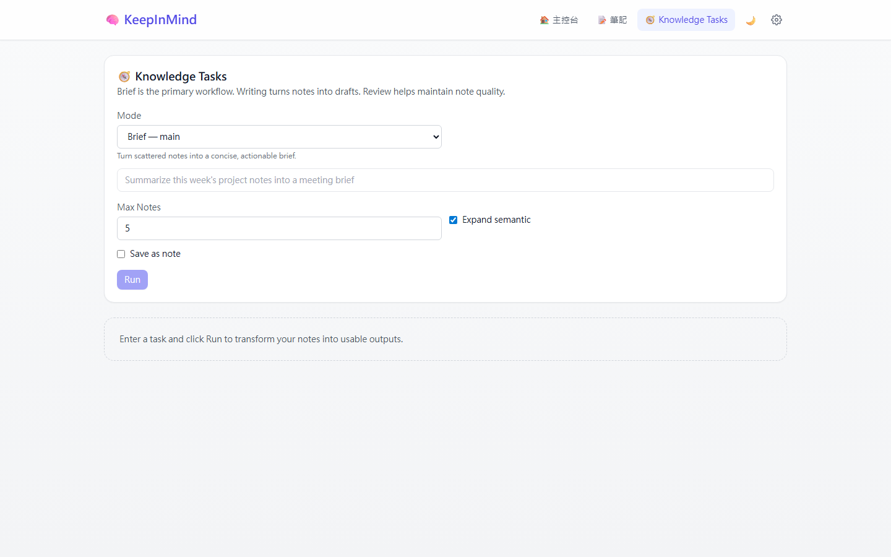

# KeepInMind — Personal Knowledge Assistant

> A local-first desktop app that transforms raw notes into a queryable, AI-enriched knowledge base.
> Built solo end-to-end: Electron + React + TypeScript + SQLite + OpenAI + MCP.

---

## Screenshots





---

## Technical Highlights

- **Full-stack desktop architecture** — designed and implemented the entire IPC bridge between an Electron main process and a React renderer, with a type-safe preload contract enforced at compile time
- **Custom vector search pipeline** — embedded every note with OpenAI `text-embedding-3-small` (1536-dim), stored as binary blobs in SQLite, and implemented cosine similarity retrieval from scratch without a vector database dependency
- **Knowledge graph with multi-hop traversal** — extracted concept triples `(subject, relation, object)` via LLM, deduped using canonical normalization, and built a 2-hop CTE query for subgraph exploration
- **Background AI job queue** — architected an async worker (`ai_job_worker.ts`) that enqueues enrichment jobs (summary, tags, triples, embeddings) so the UI never blocks on AI calls
- **Zero-downtime schema migrations** — applied additive `ALTER TABLE` migrations at startup using `PRAGMA table_info` checks inside a `serialize()` block — no migration framework, no downtime
- **MCP server integration** — implemented a stdio Model Context Protocol server exposing the app's retrieval and synthesis capabilities to any external AI client, reusing the internal agent tool layer
- **Deterministic AI pipeline** — built a `MOCK_OPENAI=1` mode with deterministic mocks for all AI services, enabling offline development and CI testing without API keys
- **Design system from scratch** — built a reusable component library (Badge, Button, Card, Modal, Tabs, Chip, Slider, Input) with a CSS custom-property token system supporting light/dark theming

---

## What It Does

Write a note. KeepInMind automatically:
1. Saves it to a local SQLite database
2. Generates a summary and tags via GPT-4o-mini
3. Extracts structured concept triples and builds a knowledge graph
4. Embeds the content and finds semantically related notes
5. Makes everything queryable through an interactive graph and AI workflows

**Knowledge Tasks** — a higher-order synthesis layer with three modes:

| Mode | Output |
|---|---|
| **Brief** | Key updates, risks, and next steps — grounded in your notes |
| **Writing** | A titled, outlined draft document built from your note corpus |
| **Review** | Duplicate detection, content overlap analysis, and merge suggestions |

---

## Architecture

```
┌─────────────────────────────────────┐
│         React Renderer (Vite)        │
│  Notes · Graph · Knowledge Tasks     │
└──────────────┬──────────────────────┘
               │ contextBridge (type-safe IPC)
┌──────────────▼──────────────────────┐
│         Electron Main Process        │
│                                      │
│  IPC Handlers   Background Worker   │
│  ┌──────────┐  ┌──────────────────┐ │
│  │ notes    │  │  AI job queue    │ │
│  │ graph    │  │  · summarize     │ │
│  │ semantic │  │  · embed         │ │
│  │ research │  │  · extract       │ │
│  └────┬─────┘  └────────┬─────────┘ │
│       │                 │            │
│  ┌────▼─────────────────▼─────────┐ │
│  │           SQLite3              │ │
│  │  notes · embeddings · graph   │ │
│  └────────────────────────────────┘ │
└──────────────────────────────────────┘
               │ stdio (MCP)
┌──────────────▼──────────────────────┐
│      External MCP Client             │
│  search · semantic · run_brief ...   │
└──────────────────────────────────────┘
```

### Key Design Decisions

**IPC boundary contract** — `noteId` is always `string` at the renderer/IPC boundary and parsed to `integer` inside handlers. This prevents type coercion bugs across the Electron process boundary and is enforced by the shared `ElectronAPI` TypeScript interface.

**Canonical deduplication** — concept relations are stored with `canonical_source` / `canonical_target` (trimmed, lowercased). This lets the graph merge `"Machine Learning"`, `" machine learning "`, and `"machine learning"` into one node without LLM-based deduplication.

**Knowledge Task retrieval** — tasks use a two-stage pipeline: keyword search for precision, followed by embedding similarity expansion for recall. The combination is tunable (`expandSemantic`, `maxNotes`) and fully traceable in the output.

---

## Tech Stack

| Layer | Technology |
|---|---|
| Desktop shell | Electron 28 |
| Frontend | React 19, TypeScript, Vite 7 |
| Styling | Tailwind CSS 3, Framer Motion |
| Graph rendering | vis-network 9 |
| Database | SQLite3 (node-native) |
| AI | OpenAI SDK v5 — GPT-4o-mini, text-embedding-3-small |
| MCP | @modelcontextprotocol/sdk (stdio transport) |
| Testing | Vitest 3, React Testing Library |
| Routing | React Router DOM 7 (HashRouter for `file://`) |

---

## Quick Start

**Prerequisites:** Node.js 18+, npm 9+, an OpenAI API key (or use `MOCK_OPENAI=1` for offline mode)

```bash
git clone <repo-url>
cd personal_db_assistant
npm install

cp .env.example .env
# Add OPENAI_API_KEY to .env

npm run dev
```

**Offline / no API key:**
```bash
MOCK_OPENAI=1 npm run dev
```

---

## Scripts

| Command | Description |
|---|---|
| `npm run dev` | Vite dev server + Electron with live reload |
| `npm run build` | Compile Electron TypeScript + Vite production bundle |
| `npm run smoke` | Build then launch — production validation in one command |
| `npm test` | Run all unit tests headlessly (CI-friendly) |
| `npm run test:ui` | Vitest interactive browser UI |
| `npm run seed:notes` | Import demo notes for Knowledge Tasks (see `docs/SEEDING.md`) |
| `npm run mcp` | Start the MCP stdio server |

---

## Testing

Tests use an in-memory SQLite database (`:memory:`) for full isolation. All `window.electronAPI` methods are stubbed in `tests/setup.ts`, allowing renderer components and hooks to be tested without Electron.

```bash
npm test        # headless, exits with pass/fail
npm run test:ui # interactive Vitest UI
```

Coverage: AI job lifecycle · graph query params · semantic relation building · UI components · Related Notes panel · Knowledge Task runner

---

## Environment Variables

| Variable | Required | Description |
|---|---|---|
| `OPENAI_API_KEY` | Yes (for AI) | Summarization, embeddings, triple extraction |
| `MOCK_OPENAI` | No | Set to `1` — deterministic mocks, no network calls |

---

## Project Structure

```
electron/
├── main.ts                  Entry — window, IPC registration, worker start
├── preload.ts               contextBridge (type-safe renderer API)
├── db/                      Schema, migrations, connection singleton
├── ipc/                     notes · graph · semantic · research · relation
├── services/                ai_service · embedding_service · relation_service · ai_job_worker
├── agent/                   Knowledge Task pipeline (tools + runner + prompts)
└── mcp/                     stdio MCP server + tool wrappers

src/
├── features/
│   ├── notes/               Note list, cards, input, search
│   ├── graph/               Graph visualization (vis-network)
│   ├── research/            Knowledge Tasks UI
│   ├── dashboard/           Dashboard overview
│   └── common/ui/           Design system components
├── hooks/                   useNotes · useGraph · useAI · useSemanticNotes
├── types/                   ElectronAPI interface + shared types
└── styles/                  CSS token system (light/dark)
```

---

## MCP Integration

An optional stdio server exposes retrieval and synthesis tools to any MCP-compatible AI client:

| Tool | Description |
|---|---|
| `search_notes` | Keyword search — ids, tags, preview |
| `get_note` | Fetch note by id |
| `semantic_search_notes` | Embedding similarity search |
| `run_brief` / `run_writing` / `run_review` | Knowledge Task modes |

See [`docs/MCP.md`](docs/MCP.md) for tool schemas and example invocations.

---

## License

MIT
